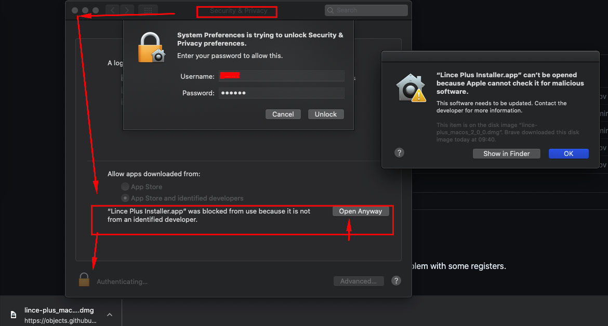

LINCE PLUS is a project under development through a Phd study with the collaboration of Inefc Catalunya.

## About LINCE PLUS

LINCE PLUS is a visualization tool for research, that let's you analyze data and organize your study

## Article Citation

Please, if any use or scientific research is done through this application, cite us to improve:

- Soto, A, Camerino, O, Anguera, M.T., Iglesias, X., & Castañer, M.,  (2022): LINCE PLUS Software for Systematic Observation Studies of Sports and Health. _Behavior Research Methods 54_ , 1263–1271 , https://doi.org/10.3758/s13428-021-01642-1

- Soto, A., Camerino, O., Iglesias, X., Anguera, M. T., & Castañer, M. (2019). LINCE PLUS: Research Software for Behaviour Video Analysis. _Apunts. Educación Física y Deportes_, 137, 149-153. doi:10.5672/apunts.2014-0983.es.(2019/3).137.11

### Contact 

- Any bug, mistake or improvement can be suggested using the "issues" part from this project
- Check online documentation and our wiki 
- For any usage or request please send an email to alberto.soto@gmail.com

### Supported languages

Our software it's build on a multilanguage base: Spanish, English, German and Catalan

### System requirements

- LINCE PLUS works in any computer (x64) and has been tested with Win10 and MacOS ARM and chipset intel
- We do not have license as it needs a fee and it's free software.

## Download 

[https://github.com/observesport/lince-plus/releases/tag/v3.2.4](https://github.com/observesport/lince-plus/releases/tag/v3.2.4)

### Current version 3.2.4

Lince Plus 3.2.4 Release Notes

#### Overview

Recommended update as it solves a critical issue during export:

- Update to Spring 3.3.9
- Solves exportation error and generates a new environment for excel
Decoupled behaviour on registration:
- User selection on excel export without converting to legacy lince
- Sets frame value with current project settings, not using default FPS
- When selecting a video it sets automatically the FPS of the project
- Exportation introduces revisited conversion for FPS calculation and scene duration
- New flow for lince v1.4 import/export
- Significative improvements on unit testing

### Version 3.2.3 Release notes

This release focuses on modernizing the technology stack, improving installation reliability, and enhancing cloud compatibility to better support enterprise deployments.

#### Major Changes

**Framework Updates**

- JDK17
- Upgraded to Spring Boot version 3.2.3
- Enhanced dependency injection system to support Lince Cloud extensions
- Improved cloud-native compatibility for containerized deployments

**Installation Improvements**

- New automated installer package generated through CI/CD pipeline
- Fixed installation issues on macOS systems
- Resolved permission handling during setup
- Improved application registration process
- Addressed Windows-specific installation problems
- Fixed path resolution conflicts
- Enhanced registry management
- Corrected service installation procedures

**Cloud Integration**

- Added cloud-native configuration options
- Implemented extensible dependency injection framework for Lince Cloud
- Enhanced service discovery capabilities
- Improved container orchestration support

> Installation Instructions

The new installer package can be downloaded from the official Lince repository. For detailed installation steps, please refer to the updated documentation.

**System Requirements**

- macOS 10.15 or later
- Windows 10/11 or Windows Server 2019/2022
- 4GB RAM minimum
- 2GB available disk space

> Known Issues

On Windows systems with restricted user permissions, manual elevation may be required during installation
macOS users should ensure Terminal has full disk access enabled in System Preferences
  
[Download it here](https://github.com/observesport/lince-plus/releases/tag/v3.2.4)

## Documentation

- Check the youtube channel! [LINCE PLUS YOUTUBE](https://www.youtube.com/channel/UCyLQlDtUYWz6dZJ4B2HV-2g)
- Check our on-line guide in [spanish](http://learning.albertosoto.es/lince-plus-guide.html) or in [english](http://learning.albertosoto.es/lince-plus-guide_en.html)
- Check our workshop material at [workshop](http://learning.albertosoto.es/Lince-plus-workshop1.html)
- Check our installation and use guide at our wiki, under development, on our [wiki](https://github.com/observesport/lince-plus/wiki)

### Previous versions

- [3.2.3 - Mac x64 & Windows x64 (w10)](https://github.com/observesport/lince-plus/releases/tag/v3.2.3)
- [2.1.0 - Mac x64 & Windows x64 (w10)](https://github.com/observesport/lince-plus/releases/tag/v2.1.0)
- [2.0.0 - Mac x64 & Windows x64 (w10)](https://github.com/observesport/lince-plus/releases/tag/v2.0.0)
- [1.3.2 - Mac x64 & Windows x64 (w10)](https://github.com/observesport/lince-plus/releases/tag/v1.3.2)
- [1.3.1 - Mac x64 & Windows x64 (w10)](https://github.com/observesport/lince-plus/releases/tag/v1.3.1)
- [1.3.0 - Mac x64 & Windows x64 (w10)](https://github.com/observesport/lince-plus/releases/tag/v1.3.0)					  
- [1.2.0 - Mac x64 & Windows x64 (w10)](https://github.com/observesport/lince-plus/releases/tag/v1.2.0)
- [1.1.2 - Mac x64 & Windows x64 (w10)](https://github.com/observesport/lince-plus/releases/tag/v1.1.2)
- [1.1.1 - Mac x64 & Windows x64 (w10)](https://github.com/observesport/lince-plus/releases/tag/v1.1.1)
- [1.1.0 - Mac x64 & Windows x64 (w10)](https://github.com/observesport/lince-plus/releases/tag/v1.1.0)
- [1.0.3 - Mac x64 & Windows x64 (w10)](https://github.com/observesport/lince-plus/releases/tag/v1.0.3)
- [1.0.2 - Mac x64 & Windows x64 (w10)](https://github.com/observesport/lince-plus/raw/master/lince-PLUS-1.0.2-RELEASE.msi)	
- [1.0.1 - Mac x64 & Windows x64 (w10)](https://github.com/observesport/lince-plus/raw/master/lince-PLUS-1.0.1ga-RELEASE.msi)
- [1.0.0 - Mac x64 & Windows x64 (w10)](https://github.com/observesport/lince-plus/raw/master/lince-PLUS-1.0.0-RELEASE-win.msi)

### Important: MacOS users

20/02/2020 Since the update of MacOS Catalina YOU NEED TO ENABLE MAC OS EXTERNAL SOFTWARE to install LINCE PLUS.
We are working on the licensing issue, but, until it´s solved you must follow this procedure: [Install uncertified software - ES ](https://support.apple.com/es-es/guide/mac-help/mh40616/mac) o [Install uncertified software - EN](https://support.apple.com/en-us/HT202491).

### Bugs or problems? No problem

Use our bug system to report any problem at [bug reporting](https://github.com/observesport/lince-plus/issues)

## Support

LINCE PLUS has been develop using [Jetbrains Suite](https://jb.gg/OpenSource) thanks to their license support for Open source projects. 

LINCE PLUS installer is build using Install4J [multi-platform installer builder](https://www.ej-technologies.com/products/install4j/overview.html) thanks to their license support for Open source projects. 

## Release notes

- Version 2.1.0 RELEASE, 02/10/2023
	- AI Studio
	- new Video Player
    - Youtube player update
  
- Version 2.0.0 RELEASE, 03/07/2023
	- GA4 intro
 	- Spring boot 2.7
    	- JDK 17 upgrade from 1.8
    	- [Support issues solved](https://github.com/observesport/lince-plus/milestone/1?closed=1)
       
- Version 1.3.2 RELEASE, 20/01/2021
	- Excel CSV error review 
  
- Version 1.3.1 RELEASE, 05/10/2020
	- Solves problems with big instruments.
	- This version resolves the following issues:
		- Exporting data does not break anymore
		- Improving performance on visualization and recording
		- Better Quantitizing phase
		- GA

- Version 1.3.0 RELEASE, 30/06/2020
	- UI Enhancement & web redesign
	- React + lerna monorepo + full microservices aproach
	- Scene program
	- Keyboard usage
	- Multi-observer exporting support
	- Lince v1 support reviewed
	
- Version 1.2.0 RELEASE, 21/05/2020
	- Solves multiobserver problems
	- Adds transcoding support. Lince can convert automatically now to mp4 any video you choose.
	
- Version 1.1.2 RELEASE, 25/02/2020
	- creation of new observers from legacy Lince register import  
	- kappa index review  
	- video analysis improvement: better dragable area, minimal gaps to improve UX and shows description when the mouse goes over
	- adaptative graphs
	- legacy instrument review
	- log improvement and better messaging
	- temporal saving 
	- mac update. License needed. Installer has been updated.
	- better working atmosphere with margin decrease 
	- PoP (Picture on picture) behaviour review

- Version 1.1.1 RELEASE, 10/12/2019
    - Repairs problems on importing files
    - Includes change version notificacion
    - Source clean up
    - Adds localhost on view option
    - Improves QR
    - Sandboxing https support

- Version 1.1.0 RELEASE, 20/11/2019
This version is a major update. New features
	- Installer works on mac os 100%
	- Installer improvements on windows (needs resolve uninstall for previous version)
	- QR code generator for devices connection
	- Network utils
	- Recording sandbox
	- Video chrono
	- Mix data: Information nodes on toolbox
	- Unit tests
	- Renjin version update (carefully)
	- CSV export update
	- Web update

- Version 1.0.3 RELEASE, 06/08/2019
    - Multi-observer file import issues
    - Non-existing file check on autoload
    - MacOS installer with embedded JRE
    - Win10 installer with embedded JRE
    - Valid CSV export with ; or ,
    - MacOS can open browser and files properly

- Version 1.0.2 RELEASE, 01/07/2019
	- File issues on MACos are solved. This includes, importing and exporting files, browser opening and video selection
	- Native swing adapter for javafx
	- Solved multitier file saving (javafx can't open file dialog on old swing operating)
	- Added testing operations
	- This is an stable version
	- Installer contains java jre check on windows
	- MacOs must have user interaction for java setup

- Version 1.0.1 RELEASE, 12/06/2019
    - Unit testing included
    - Valid i18n
    - Exporting register to theme
    - Support for CSV and tab files native on lince plus
    - GA
    - Desktop app new Design with interactive stats 

- Version 1.0.0 RELEASE, 10/06/2019
    - Initial desktop version
    - MacOS installer
 
<!-- Google tag (gtag.js) -->

